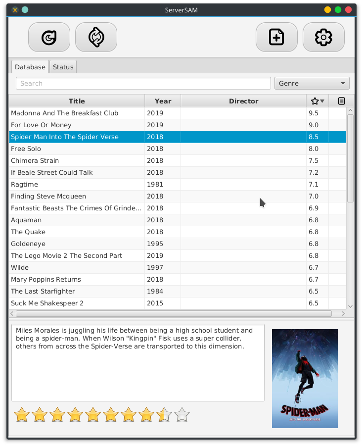
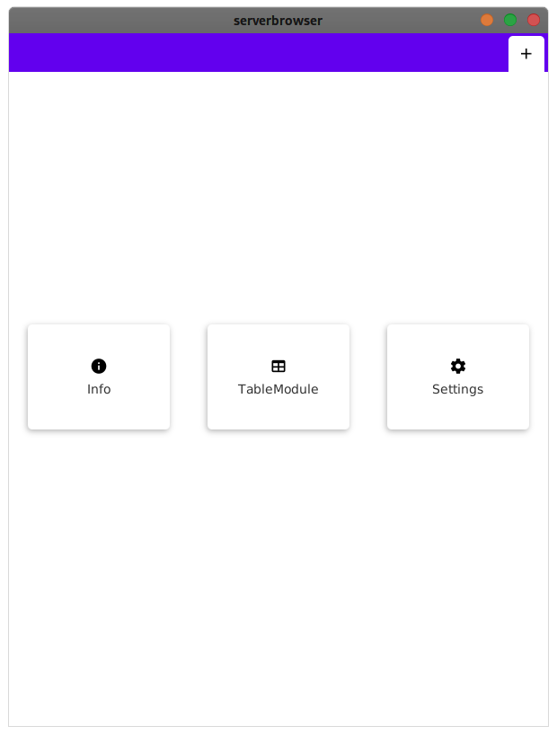

  

# এটা কি জিনিস ?

ServerSAM হল একটি Java program । এটার কাজ হল  [SamOnline](http://172.16.50.4) Server থেকে যত মুভি আছে 
তা Collect করবে এবং plot summary ও rating সহ দেখাবে এমনকি চাইলে subtitle সহ download করা যাবে।

## কি দরকার ?

প্রথমেই বলে নিতে হচ্ছে আমি অনেক বড় Cinephile। প্রচুর মুভি দেখেছি এবং দেখছি।
বেশি মুভি দেখার সমস্যা হল জনপ্রিয় সব মুভি দেখা হয়ে যায়, পরে কি দেখব তা বের করতে অনেক সময় লাগে।
মুভি অনুসন্ধানের পিছে সময় কমাতে এই project। অনেক ISP দের মোটামুটি বড় ধরেন Movie Collection থাকে 
কিন্তু ওটার সবচেয়ে বড় সমস্যা হচ্ছে এখানে দ্রুত সার্চ করার উপায় নেই কিংবা রেটিং, প্লট জানার উপায় নেই। এই প্রোগ্রাম
এর মাধ্যমে একবার scan করে নিলেই তাদের পুরো কালেকশন সার্চ করা যাবে। এবং সামারি ও রেটিং দেখে দ্রুত মুভি নির্বাচন করা যাবে।

##  দেখতে কেমন?

### JDK 8

### Latest (কাজ চলছে)

 আরও Screenshot আছে `docs/image/` ফোল্ডার এ।

## কিভাবে পাব?

 --distribution WIP--

|   |  |
| ------------- | ------------- |
|   |   |
|   |   |
